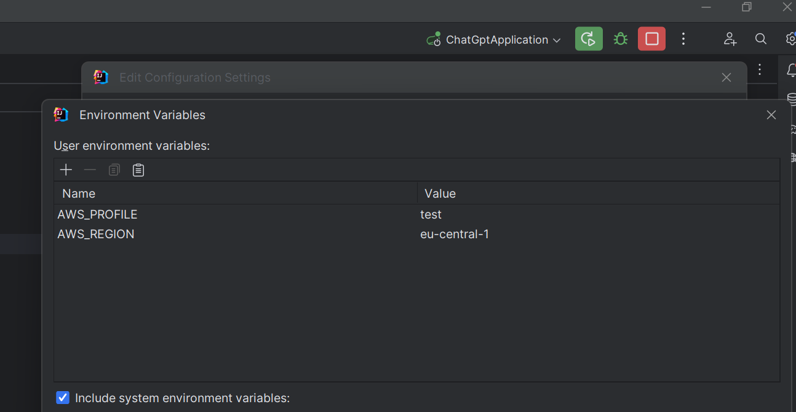

# OpenAI Vaadin Client *REQUIRES API KEY

To use the services of OpenAI, an API key is required.

This key must be stored either in the application.yml under the value apikey or

it is stored in the AWS Systems Manager Parameter Store by Amazon.

## Set Up AWS

Create an entry for your personal Parameter Store in your OS user directory under /.aws/credentials, for example:

```
[test]
aws_access_key_id=AK000000000000000074
aws_secret_access_key=XYZ
```

Since this is not the [default] profile, the environmental variables need to be set at startup:


AWS_PROFILE=test;AWS_REGION=eu-central-1

It is important not to forget the region, as otherwise it will not work. After startup, the terminal can be used to check if the key is correct, see:

```------------------- API Key -> XXX``` (should be deactivated in production)

## ChatGPT

API: https://platform.openai.com/docs/api-reference/chat

The address is: http://localhost:8080/chat

